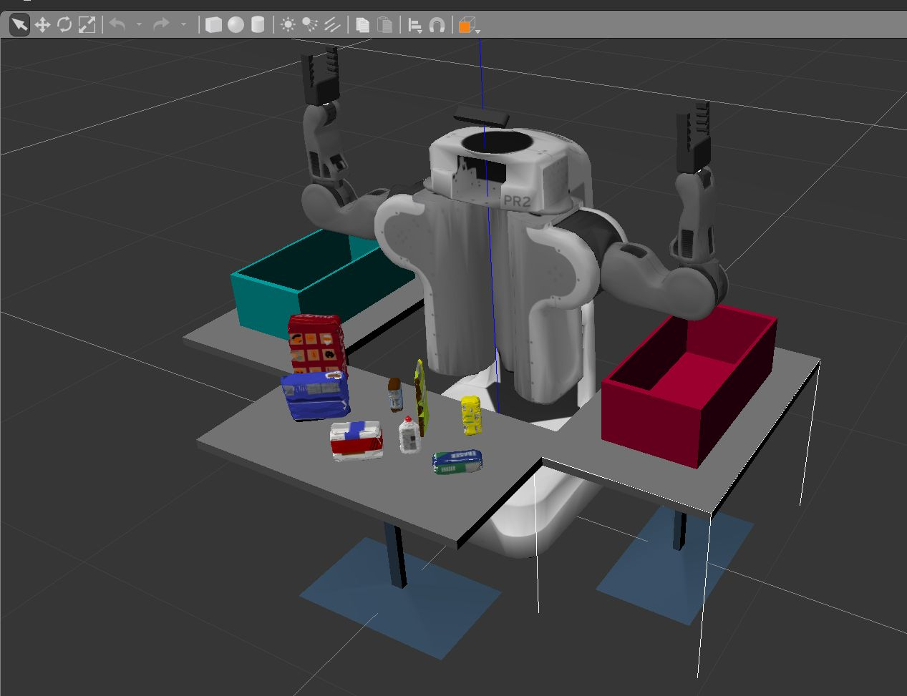

## Project: Perception Pick & Place

  

## [Rubric](https://review.udacity.com/#!/rubrics/1067/view) Points
### Here I will consider the rubric points individually and describe how I addressed each point in my implementation.  

---
### README

#### Provide a Writeup / README that includes all the rubric points and how to addressed each one. 

### Exercise 1, 2 and 3 pipeline implemented

#### 1. Complete Exercise 1 steps. Pipeline for filtering and RANSAC plane fitting implemented.
In this exercise, for the first time process is converting ROS message into PCL data. The output of PCL data can be seen on the picture below :

  

#### 2. Complete Exercise 2 steps: Pipeline including clustering for segmentation implemented.  

#### 2. Complete Exercise 3 Steps.  Features extracted and SVM trained.  Object recognition implemented.
Here is an example of how to include an image in your writeup.

### Pick and Place Setup

#### 1. For all three tabletop setups (`test*.world`), perform object recognition, then read in respective pick list (`pick_list_*.yaml`). Next construct the messages that would comprise a valid `PickPlace` request output them to `.yaml` format.

And here's another image! 

Spend some time at the end to discuss your code, what techniques you used, what worked and why, where the implementation might fail and how you might improve it if you were going to pursue this project further.  

